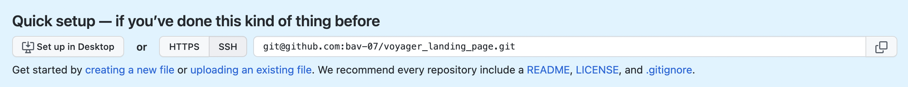
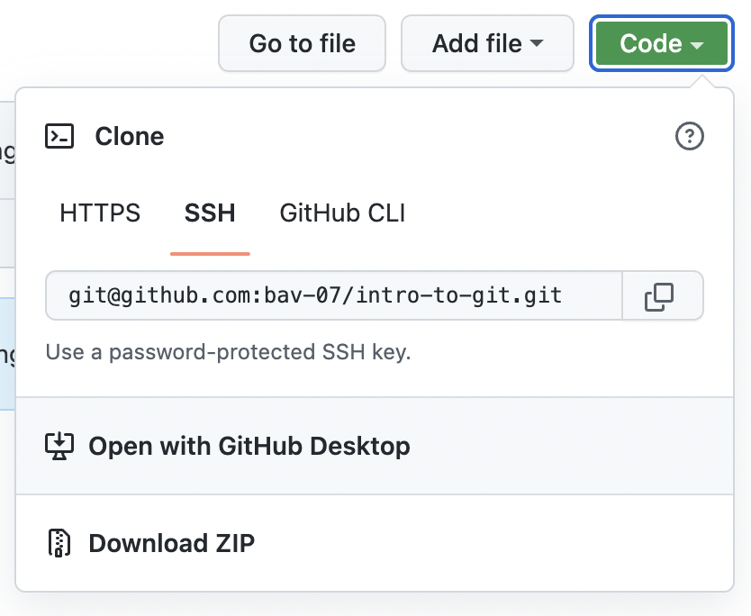

<link rel="stylesheet" href="styles.css">

# **Command-Line Cheat Sheet**
This cheat sheet provides a summary of command-line commands that can be used in the terminal, including Git commands.

## **Terminal**

### Navigation Commands

| Command | Description |
| ------- | --------------------- |
| `pwd` | Short for "**p**rint **w**orking **d**irectory". <br> Can be used to determine which directory you are currently in, including the path followed to get there. |
| `ls` | Lists all files and folders within the current directory (excluding hidden files/folders). Can be combined with *flags*, as described below. |
| `ls -l` | On top of `ls`, the `-l` flag can be used to show additional information about all shown files/folders, inlcuding owner, permissions and date last modified. |
| `ls -a` | On top of `ls`, the `-a` flag can be used to show hidden files/folders. |
| `ls -al` | Combines the `-a` and -`l` flags, showing all files/folders including those hidden, with additional information. |
|  `cd` | Short for "**c**hange **d**irectory". Used to move between directories. <br> **Use cases:**<ul><li>```cd``` on its own takes you to your home directory;</li><li>`cd -` takes you to the directory you were in directly prior;</li><li>`cd Documents` takes you into the Documents folder. It can be used whilst in the parent folder of Documents.</li><li>`cd Documents/coursework` takes you into the coursework folder, that is within the Documents folder. It can be used whilst in the parent folder of Documents.</li><li>`cd ..` is used to move into the parent directory of the current one.</li><li>Whilst using `cd`, it can be useful to keep in mind that the `tab` key can be used to autocomplete commands. If there are multiple autocomplete options, `tab` can be used repeatedly to select which option to use, before hitting `return` to confirm the selection.</li></ul> |

### Creating Files and Folders

Follow these rules for naming new files/folders:

<!--Markdown does not care about the number of the list item, it still lists it with the right numbering anyway!-->
1. Do not give it the same name as its parent directory.
1. Do not use / or . in file names.
    - Also, avoid using \ as it is a separator character in Windows
1. Avoid using spaces/whitespace: use underscores (_) instead, or capitalise letters - follow one of the following conventions to keep professionality:
    - `snake_case` - this is where spaces are replaced by underscores, and is the most popular file naming convention.
    - `camelCase` - this is where spaces are eliminated by capitalising the following letter.

| Command | Description |
| ------- | --------------------- |
| `mkdir` | Short for "**m**ake **d**irectory". Creates a new directory within the current directory.<br>**Use cases:**<ul><li>`mkdir new_directory` makes a new directory called new_directory within the currently situated directory.</li><li>`mkdir Documents/new_directory` makes a new directory within the Documents directory, and can be used from within the parent directory of Documents.</li></ul>|
| `touch` | Used to create a file within the currently situated directory.<br>**Use cases:**<ul><li>`touch facts.txt` creates a file called facts.txt within the current directory. Remember to give each file name an extension, unless you want to leave the file type as undefined.</li></ul>


### Opening Files and Folders
| Command | Description |
| ------- | --------------------- |
| `open` | Used to open files/directories, using the default program.<br>**Use cases:**<ul><li>`open facts.txt` will open the text file using a text editor.</li><li>`open Documents` will open Documents using the Finder (on Mac). This can be used whilst within the parent directory of Documents.</li><li>`open .` opens the directory you are currently in.</li><li>`open ..` opens the parent directory to the one you are currently in.</li><li>`open Documents/new_directory` opens the new_directory folder within Documents, and can be used when in the parent directory of Documents, i.e. the full path must be provided for any file/folder that is not within the currently situated directory.</li></ul> |
| `code` | Used to open the file/directory in VSCode (Visual Studio Code).<br>**Use cases:**<ul><li>`code .` opens the currently situated directory in VS Code.</li><li>`code facts.txt` opens the text file in VS Code.</li></ul>


### Manipulating Files and Folders
| Command | Description | Use Cases |
| ------- | --------------------- | ---- |
| `mv` | Used to **move** and/or **rename** a file. | `mv photo.png ..`<ul><li>moves photo.png into its parent directory.</li></ul>`mv photo.png new_directory`<ul><li>moves photo.png into new_directory. This can be used when new_directory is a child of the currently situated directory.</li></ul>`mv photo.png picture.png`<ul><li>**renames** photo.png into picture.png</li></ul>`mv photo.png ../picture.png`<ul><li>moves photo.png into its parent directory *and* renames it to picture.png.</li></ul>|
| `cp` | Used to **copy** files/folders. The flag `-r` is added for copying directories. | `cp facts.txt new_directory`<ul><li>copies facts.txt into new_directory, a folder which must be a child of the current directory.</li></ul>`cp photo.png Photos/picture.png`<ul><li>moves photo.png into Photos *and* renames it to picture.png simultaneously. The current folder must be a parent of Photos.</li></ul>`cp facts.txt ../features.txt` <ul><li> moves facts.txt into its parent directory *and* renames it to features.txt.</li></ul> </ul> |

### Deleting Files and Folders

Tread carefully: any files deleted using the command-line are deleted permanently. There is no recovering them (unless you go to a data recovery specialist).

Be *especially* careful not to delete critical files, or else you could brick your device - but the command-line should warn you if you are about to delete a critical file (as long as you don't use the `-f` flag).

| Command | Description | Use Cases |
| ------- | --------------------- | ---- |
| `rm` | Used to **delete** files. | `rm facts.txt` - deletes facts.txt |
| `rm -r` | Used to delete directories. Will warn the user if an important file is enocuntered. | `rm -r new_directory` - deletes new_directory. |
| `rm -rf` | `-f` stands for "forced". It bypasses all security measures to recursively delete everything within the chosen directory, without asking the user for any confirmation. This should not be used ***only*** use when in the presence of a supervisor. | `rm -rf new_directory` - deletes directory whilst bypassing all security measures. |

### More Terminal Tricks
Here are some handy tricks that could result in more efficient terminal use. 
- Use `history` to see the last 10000 commands used in the terminal.
- Use the `up` and `down` arrows to find previously used commands.
    - This is especially useful when having to repeat commands.
- Use `ctrl` + `c` to end a process in the terminal
- Use `ctrl` + `l` or `clear` to clean up the terminal window
    - The terminal does this by putting enough whitespace between your last 2 commands, such that only the last line in your terminal is left as visible in window.


## **Git**

Git is a version control system (VCS) used to record the completely history of a project. It is installed locally, enabling users to log changes without needing to be connected to the server. Git allows users to roll back their code to previously logged versions. Git repositories can be hosted on GitHub, which allows code to be shared with others - this makes collaboration between team members working on the same software vastly more accessible.

<br>

### Adding and Committing using Git  

| Command | Description |
| ------- | --------------------- | 
| `git init` | Used to initialise a git repository in the current directory, allowing the computer to track changes to files within the repo. An initialised repo can be identified with `git:(main)` after the repo name: <br>  |
| `git status` | Provides status on the repo, revealing any modified files, or untracked files.
| `git add` | Stages the changes to the chosen files, preparing them for commitment.<br>**Use cases:** <ul><li>`git add .` will stage the changes to all files in the repo.</li><li>`git add index.html` will stage the changes to only index.html.</li></ul> |
| `git commit` | Commits the staged changes, recording the details of any changes to the files, and saving this to the log of changes. A message (required) must be added using `-m "message goes here"`.<br>**Use cases:** <ul><li>`git commit -m "adds index.html"` will commit the changes, with the message. After committing, the repo is once again considered as unmodified, and so the following commit will include all the changes since this commit.</li></ul> |
| `git log` | Provides a history of all commits in the directory. Exit the log with `q`. |
<br>

### Rolling Back to Previous Versions using Git
`git revert "7-digit ID"`
- This undoes any of the changes that were committed in the chosen commit.
        - The "7-digit ID" refers to the first 7 digits of the commit ID, which can be found in the log using `git log`.
    - If any changes that were committed after the selected commit include dependencies on the changes being undone, those dependencies will be broken and such that code may no longer work.
    - After using `revert`, a Vim editor will open: exitting this by typing it `:q` then `return` will ensure the revert is confirmed
    - It will show as a commit in the log.

`git reset "7-digit ID"`
- This undoes all changes that were committed **since** the chosen commit
    - This means all commits that were committed after the selected one are also undone.

<br>

### Uploading Code to GitHub
Before doing this, ensure you have added an SSH key corresponding to your current device. You can use the instructions [here](https://github.com/BrightNetworkTechAcademy/c7_coursenotes/blob/main/laptop_setup_reset/adding_SSHkey_GitHub.md) to do so.

Follow these steps to upload your local repository to GitHub.

1. Create a remote repository on GitHub
2. Copy the SSH url from GitHub, as shown here:<br>

3. Use the following command to link the local repository with the remote repository on GitHub:
    <br>
    ```
    git remote add origin your/url/here
    ```
    Replace `your/url/here` with your SSH url from Step 2.
    <br><br>
4. Use the following command to push the local repository to the remote repository:
    <br>
    ```
    git push origin main
    ```
    This command can also be used to update the remote repository with the local changes

If you view the repository in GitHub, you should see your files, along with the commit history of your repository.

<br>

### Cloning a Repository from GitHub

Follow these steps to clone a repository into your local files, allowing you to access these files locally.

1. Copy the repository url by clicking on the green Code button as shown below, ensuring you have selected the SSH tab:<br>


2. Navigate to the desired parent folder in your terminal. Be careful not to clone a repository inside another repository!

3. Use the following command in your terminal
    ```
    git clone repository/url/here
    ```
    Replace `repository/url/here` with the SSH url you copied in Step 1.

You can then use the following command to ensure your local repository is up-to-date, by downloading any changes that were committed since you cloned the repository:
```
git pull origin main
```